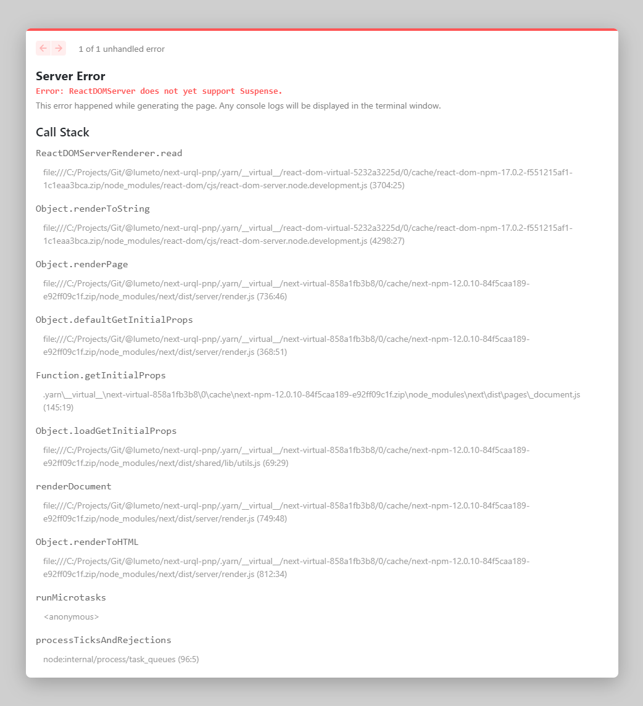

## Reproduce

```bash
yarn dev
```

Open [http://localhost:3000](http://localhost:3000) with your browser to see the result.

Both page and console will log error:

```log
Error: ReactDOMServer does not yet support Suspense.
```

